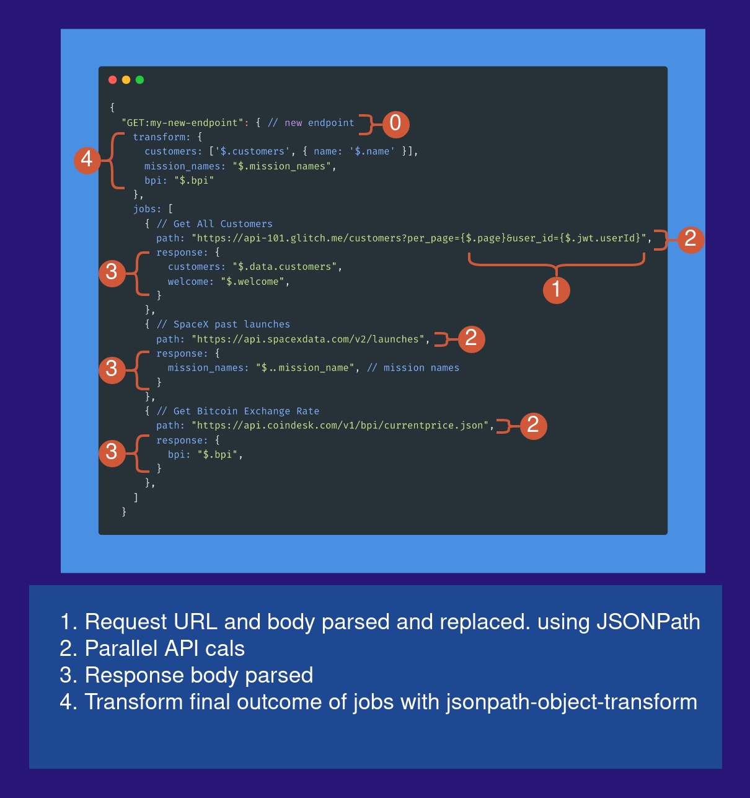

Proxy Api Transformer
=====================

### Transform, Mutate, Wrap your existing APIs

#### Serverless AWS Api gateway proxy function

### Features
- Create new endpoint mapped to an existing endpoint with transformed structure
- Combine several existing endpoints into Parallel or Waterfall\* workflows
- Resolve Request body / path, Response using [JSONPath](https://github.com/JSONPath-Plus/JSONPath)
- Transform final jobs output using [jsonpath-object-transform](https://github.com/dvdln/jsonpath-object-transform) or pure javascript function
- Callback, usefull for attaching other workflows to an existing or new endpoint, such as counters, webhooks and more
- Rich Config syntax [sample config.js](./config/index.js#L12)

#### Sample Config



```bash
curl --request GET \
  --url http://localhost:3000/dev/al/my-new-endpoint
```

```json
{
  "customers": [
    {
      "name": "Blanche Devereux"
    },
    {
      "name": "Rose Nylund"
    },
    {
      "name": "Shady Pines"
    }
  ],
  "mission_names": [
    "ANASIS-II",
    "Starlink-9 (v1.0) & BlackSky Global 5-6",
    "Starlink-10 (v1.0) & SkySat 19-21",
    "SAOCOM 1B, GNOMES-1, Tyvak-0172",
    "Starlink-11 (v1.0)",
    "Starlink-12 (v1.0)",
    "Starlink-13 (v1.0)",
    "Starlink-14 (v1.0)",
    "GPS III SV04 (Sacagawea)",
    "Crew-1",
    "Sentinel-6 Michael Freilich",
    "Starlink-15 (v1.0)"
  ],
  "bpi": {
    "USD": {
      "code": "USD",
      "symbol": "&#36;",
      "rate": "52,874.6350",
      "description": "United States Dollar",
      "rate_float": 52874.635
    },
    "GBP": {
      "code": "GBP",
      "symbol": "&pound;",
      "rate": "39,958.1548",
      "description": "British Pound Sterling",
      "rate_float": 39958.1548
    },
    "EUR": {
      "code": "EUR",
      "symbol": "&euro;",
      "rate": "46,731.7657",
      "description": "Euro",
      "rate_float": 46731.7657
    }
  }
}
```

